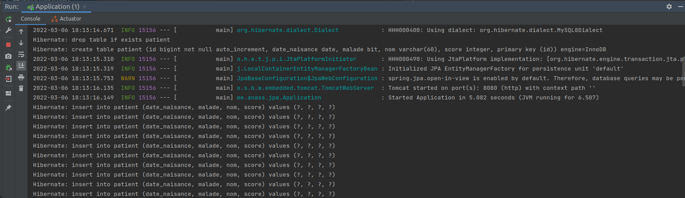

# JEE : ORM, JPA, Hibernate, Spring Data

**Date**: *28/02/2022*

Le but majeur de Spring Data JPA est de faciliter au maximum l'interaction avec la base de données en se basant sur des interface qui on des implémentations génériques.  

Spring Data JPA se base sur JPA qui la spécifications pour l'interaction avec les bases de données relationnelles. Et l'implémentation la plus utilisée de cette dernière est Hibernate.
###Utilisation de Spring Data JAP
```xml
<dependency>
    <groupId>org.springframework.boot</groupId>
    <artifactId>spring-boot-starter-data-jpa</artifactId>
</dependency>
```

##Connecteur JDBC pour la base de données H2
H2 est une base de données en memoire.

**Dépendance dans POM.xml**
```xml
<dependency>
    <groupId>com.h2database</groupId>
    <artifactId>h2</artifactId>
    <scope>runtime</scope>
</dependency>
```

**Configuration dans application.properties**
```properties
spring.datasource.url=jdbc:h2:mem:patient-db
spring.h2.console.enabled=true
```

##Connecteur JDBC pour la base de données MySql
```xml
<dependency>
    <groupId>mysql</groupId>
    <artifactId>mysql-connector-java</artifactId>
    <version>8.0.28</version>
</dependency>
```
**Configuration dans application.properties**
```properties
spring.datasource.url=jdbc:mysql://localhost:3306/db_patient?serverTimezone=UTC
spring.datasource.username = root
spring.datasource.password = motdepasse
spring.jpa.show-sql = true
spring.jpa.hibernate.ddl-auto = create
spring.jpa.properties.hibernate.dialect = org.hibernate.dialect.MySQL8Dialect
```

##Entite Patient
Les annotations @Getter @Setter @AllArgsConstructor @NoArgsConstructor sont propres à Lombok pour générer les getters, setters et les constructeurs. 
L'annotation Entity appartient à JPA et c'est elle qui mentionne que ce Javabean représente une entité JPA qui sera representer par une table dans la base de données.
```java
@Getter
@Setter
@AllArgsConstructor
@NoArgsConstructor
@Entity
public class Patient {
    @Id
    @GeneratedValue(strategy = GenerationType.IDENTITY)
    private Long id;

    @Column(name = "NOM", length = 60)
    private String nom;

    @Temporal(TemporalType.DATE)
    private Date dateNaisance;
    private Boolean malade;
    private Integer score;
    
}
```

##Repository
Pour benificier de Spring Data JPA, il faut creer une interface qui va etendre de l'interface JPARepository, pour que les methodes d'interaction seront acceciblea travert un Bean injecter par Spring de type PatientRepository

```java
public interface PatientRepository extends JpaRepository<Patient, Long> {
}
```
Pour ajouter des requêtes personnalisées, il suffit d'ajouter leurs nom dans l'interface en respectant une certaines nomenclature de Spring Data Jpa, après c'est le framework qui va leur générer une implémentation.  
Une deuxième méthode c'est en écrivant le code HQL de la requête dans l'annotation Query

```java
public interface PatientRepository extends JpaRepository<Patient, Long> {
    List<Patient> findAllByMaladeIsTrue();
    Page<Patient> findAllByMalade(Boolean malade, Pageable pageable);
    Page<Patient> findAllByMaladeAndScoreLessThan(boolean malade, int score, Pageable pageable);
    Page<Patient> findByDateNaisanceBetweenAndMaladeIsTrueOrNomLike(Data start, Data end,String keyWord, Pageable pageable);
    @Query("SELECT p from Patient p where p.dateNaisance between :x and :y or p.nom like :z")
    Page<Patient> chercher(@Param("x") Date d1, @Param("y") Date d2, @Param("z") String keyWord, Pageable pageable);
}
```

##Test de l'application
Tous d'abord on commance par injecter le repository.

```java
@SpringBootApplication
public class Application implements CommandLineRunner {

    PatientRepository patientRepository;

    @Autowired
    public void setPatientRepository(PatientRepository patientRepository) {
        this.patientRepository = patientRepository;
    }

    public static void main(String[] args) {
        SpringApplication.run(Application.class, args);
    }
}
```

Pour interroger la base de données il suffit d'appeler les méthodes générées par Spring Data JPA.
```java
@SpringBootApplication
public class Application implements CommandLineRunner {
    @Override
    public void run(String... args) throws Exception {
        patientRepository.saveAll(Arrays.asList(
                new Patient(null, "Arrhioui", new Date(), false, 1),
                new Patient(null, "Ofkir", new Date(), true, 10000),
                new Patient(null, "Med", new Date(), false, 10)
        ));

        for (int i=0; i<100; i++)
            patientRepository.save(new Patient(null, "Arrhioui", new Date(), Math.random() > .5, (int)(Math.random()*100)));
        System.out.println("======================================");
        Page<Patient> patientPage = patientRepository.findAll(PageRequest.of(0, 5));
        patientPage.forEach(System.out::println);
        System.out.println("patientPage.getTotalElements() = " + patientPage.getTotalElements());
        System.out.println("patientPage.getNumber() = " + patientPage.getNumber());
        System.out.println("patientPage.getTotalPages() = " + patientPage.getTotalPages());
        List<Patient> content = patientPage.getContent();
        content.forEach(System.out::println);
        System.out.println("======================================");
        Patient patient = patientRepository.findById(1L).orElse(null);
        if(!Objects.isNull(patient)){
            System.out.println("patient = " + patient);
        }
        patient.setScore(123);
        patientRepository.save(patient);

        System.out.println("malade =======================================================");
        patientRepository.findAllByMalade(true, PageRequest.of(0, 10)).forEach(System.out::println);
    }
}
```

