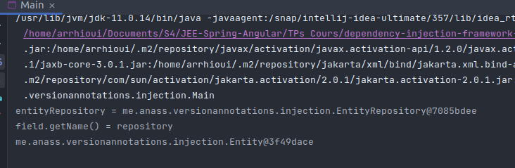

# Injection de dépendances

## Framework

### Principe
L'injection de dépendances est un mécanisme qui permet d'implémenter le principe de l'inversion de contrôle. Il consiste à créer dynamiquement les dépendances entre les différents objets en s'appuyant sur une description ou de manière programmatique.  

Dans ce TP nous allons mettre en place un framework qui permet d'assurer l'Injection de Dépendances.

# Version XML
l'idee est de charger un configuration a partir d'un fichier XML, puis injecter dans chaque Bean les dependance qu'il a besoin.

## Fichier de configiration
On a dans  cet exemple deux BEans, DAO et METIER, dans le deuxiemens BEan on remarque qu'il depende du premier Bean
```xml
<?xml version="1.0" encoding="UTF-8" standalone="yes"?>
<beans>
    <bean id="dao" class="me.anass.test.dao.Dao"/>

    <bean id="metier" class="me.anass.test.metier.Metier">
        <property name="dao" ref="dao"/>
    </bean>
</beans>
```

## Entities

### Bean
Cette class represente un Bean dans le fichier XML
```xml
package me.anass.entity;

import javax.xml.bind.annotation.*;
import java.util.ArrayList;
import java.util.Arrays;
import java.util.List;

@XmlRootElement(name = "bean")
@XmlAccessorType(XmlAccessType.FIELD)
public class Bean implements Comparable<Bean>{

    public Bean() {
    }

    public Bean(String id, Class<?> cls, Class<?> parentCls) {
        this.id = id;
        this.cls = cls;
    }

    @XmlAttribute
    String id;

    @XmlAttribute(name = "class")
    Class<?> cls;

    @XmlElement(name = "property")
    List<Property> properties = new ArrayList<>();

    public String getId() {
        return id;
    }

    public void setId(String id) {
        this.id = id;
    }

    public Class<?> getCls() {
        return cls;
    }

    public void setCls(Class<?> cls) {
        this.cls = cls;
    }

    public List<Property> getProperties() {
        return properties;
    }

    public void setProperties(List<Property> properties) {
        this.properties = properties;
    }

    @Override
    public String toString() {
        return "Bean{" +
                "id='" + id + '\'' +
                ", cls=" + cls +
                ", properties=" + Arrays.toString(properties.toArray()) +
                '}';
    }

    @Override
    public int compareTo(Bean o) {
        return Integer.compare(this.properties.size(), o.properties.size());
    }
}
```
###
### Beans
Cette classe represente l'element racine du fichier de configuration
```xml
package me.anass.entity;

import javax.xml.bind.annotation.XmlAccessType;
import javax.xml.bind.annotation.XmlAccessorType;
import javax.xml.bind.annotation.XmlElement;
import javax.xml.bind.annotation.XmlRootElement;
import java.util.ArrayList;
import java.util.Arrays;
import java.util.Collections;
import java.util.List;

@XmlRootElement(name = "beans")
@XmlAccessorType(XmlAccessType.FIELD)
public class Beans {

    @XmlElement(name = "bean")
    List<Bean> beans = new ArrayList<>();

    public List<Bean> getBeans() {
        return beans;
    }

    public void setBeans(List<Bean> beans) {
        this.beans = beans;
    }

    @Override
    public String toString() {
        return "Beans{" +
                "beans=" + Arrays.toString(beans.toArray()) +
                '}';
    }
}
```

## Extraction de donnees
Pour extraire des donnees depuis le ficher XML, j'ai mis en place une couche nomme xml, qui sera charger de faire tous traitement qui est en relation avec le XML.
Pour le moment cette couche contient une seule methode qui est nommee *xmlConfigToBeans* est qui parse un fichier XML et retourne les Beans
```java
package me.anass.xml;

import me.anass.entity.Beans;

import javax.xml.bind.JAXBException;

public interface XMLProcessor {
    Beans xmlConfigToBeans() throws JAXBException;
}
```

Voila son imlementation
```java
package me.anass.xml;

import me.anass.entity.Beans;

import javax.xml.bind.JAXBContext;
import javax.xml.bind.JAXBException;
import javax.xml.bind.Unmarshaller;
import java.io.File;

public class XMLProcessorImpl implements XMLProcessor {
    private final JAXBContext context;

    public XMLProcessorImpl() throws JAXBException {
        context = JAXBContext.newInstance(Beans.class);
    }

    @Override
    public Beans xmlConfigToBeans() throws JAXBException {
        Unmarshaller unmarshaller = context.createUnmarshaller();
        return (Beans) unmarshaller.unmarshal(new File("config.xml"));
    }
}
```

## Traitement des Bean et injection des dépendances
Dans la couche context, on trouve une interface *BeansLoader* qui est charger de parser le l'objet Baens et apres retourner un Map<String, Object> qui va representer notre context
```java
public interface BeansLoader {
    Map<String, Object> load() throws JAXBException;
}
```
Voila son imlementation

```java
package me.anass.context;

import me.anass.entity.Bean;
import me.anass.entity.Beans;
import me.anass.xml.XMLProcessor;
import me.anass.xml.XMLProcessorImpl;

import javax.xml.bind.JAXBException;
import java.lang.reflect.Field;
import java.lang.reflect.InvocationTargetException;
import java.util.Collections;
import java.util.HashMap;
import java.util.List;
import java.util.Map;

public class BeansLoaderImpl implements BeansLoader {
    XMLProcessor xmlProcessor = new XMLProcessorImpl();

    public BeansLoaderImpl() throws JAXBException {
    }

    @Override
    public Map<String, Object> load() throws JAXBException {
        Beans beans = xmlProcessor.xmlConfigToBeans();
        Collections.sort(beans.getBeans());
        Map<String, Object> beansMap = new HashMap<>();

        beans.getBeans().forEach(b -> {
            System.out.println("b = " + b);
            try {
                if(b.getProperties().size() == 0){
                    beansMap.put(b.getId(), b.getCls().getDeclaredConstructor().newInstance());
                }else {
                    Object tmpObject = b.getCls().getDeclaredConstructor().newInstance();
                    beansMap.put(b.getId(), tmpObject);
                    b.getProperties().forEach(p-> {
                        try {
                            Field field = b.getCls().getDeclaredField(p.getName());
                            field.setAccessible(true);
                            field.set(tmpObject, beansMap.get(p.getRef()));
                        } catch (NoSuchFieldException | IllegalAccessException e) {
                            e.printStackTrace();
                        }
                    });
                }
            } catch (Exception e) {
                e.printStackTrace();
            }
        });

        return beansMap;
    }
}
```

## Test
Pour tester le bon fonctionnement du framework, j'ai cree des tests unitaires
```java
package me.anass.context;

import me.anass.entity.Bean;
import me.anass.entity.Beans;
import me.anass.test.metier.Metier;
import org.junit.Before;
import org.junit.Test;

import javax.xml.bind.JAXBException;

import java.util.ArrayList;
import java.util.List;
import java.util.Map;

import static org.junit.Assert.*;

public class BeansLoaderImplTest {
    BeansLoader beansLoader;

    @Before
    public void setUp() throws JAXBException {
        beansLoader = new BeansLoaderImpl();
    }

    @Test
    public void load() throws JAXBException {
        Map<String, Object> beans = beansLoader.load();
        Metier l = (Metier) beans.get("metier");
        System.out.println("l = " + l);
    }
}
```


# Version Annotation
Dans cette partie nous allons prendre le meme exemple precedant et le faire avec les annottaions, qui est une notion introduite dans Java 5

### Les annotations utilisees

```java
package me.anass.versionannotations.annotations;

import java.lang.annotation.ElementType;
import java.lang.annotation.Retention;
import java.lang.annotation.RetentionPolicy;
import java.lang.annotation.Target;

@Target(ElementType.FIELD)
@Retention(RetentionPolicy.RUNTIME)
public @interface AutoWired {

}
```

```java
package me.anass.versionannotations.annotations;

import java.lang.annotation.Retention;
import java.lang.annotation.RetentionPolicy;

@Retention(RetentionPolicy.RUNTIME)
public @interface Component {
}
```

```java
package me.anass.versionannotations.annotations;

import java.lang.annotation.ElementType;
import java.lang.annotation.Repeatable;
import java.lang.annotation.Retention;
import java.lang.annotation.RetentionPolicy;
import java.lang.annotation.Target;

@Retention(RetentionPolicy.RUNTIME)
@Target(ElementType.TYPE)
@Repeatable(ComponentScans.class) public @interface ComponentScan {
    public String value();
}

```

```java
package me.anass.versionannotations.annotations;

import java.lang.annotation.ElementType;
import java.lang.annotation.Retention;
import java.lang.annotation.RetentionPolicy;
import java.lang.annotation.Target;

@Retention(RetentionPolicy.RUNTIME)
@Target(ElementType.TYPE)
public @interface ComponentScans {
    public ComponentScan[] value();

}
```

```java
package me.anass.versionannotations.annotations;

import java.lang.annotation.ElementType;
import java.lang.annotation.Retention;
import java.lang.annotation.RetentionPolicy;
import java.lang.annotation.Target;

@Retention(RetentionPolicy.RUNTIME)
@Target(ElementType.TYPE)
public @interface Configuration {

}
```

## Exemple
Nous allons creer une entite avec sa couch DAO et une couche service

### Entity

```java
package me.anass.versionannotations.injection;

public class Entity {
    private Long id;
    private String nom;

    public Entity(Long id, String nom) {
        this.id = id;
        this.nom = nom;
    }
}
```

### Dao avec un Data Mocking
```java
package me.anass.versionannotations.injection;

import me.anass.versionannotations.annotations.Component;

import java.util.ArrayList;
import java.util.HashMap;
import java.util.List;
import java.util.Map;

@Component
public class EntityRepository {
    Map<Integer, Entity> entityMap = new HashMap<>();

    EntityRepository() {
        entityMap.put(1, new Entity(1L, "Entity1"));
        entityMap.put(2, new Entity(2L, "Entity2"));
        entityMap.put(3, new Entity(3L, "Entity3"));
        entityMap.put(4, new Entity(4L, "Entity4"));
        entityMap.put(5, new Entity(5L, "Entity5"));
        entityMap.put(6, new Entity(6L, "Entity6"));
        entityMap.put(7, new Entity(7L, "Entity7"));
    }

    public Entity getById(Integer orderId) {
        return entityMap.get(orderId);
    }

    public List<Entity> findAll(){
        return new ArrayList<>(this.entityMap.values());
    }

}
```

La couche service contient une dependance sur la couche DAO
### Service
```java
package me.anass.versionannotations.injection;

import me.anass.versionannotations.annotations.Component;
import me.anass.versionannotations.annotations.AutoWired;

import java.util.List;

@Component
public class EntityMetier {
    @AutoWired
    private EntityRepository entityRepository;

    public Entity getEntityDetails(Integer orderId) {
        return repository.getById(orderId);
    }

    public List<Entity> getAll() {
        return repository.findAll();
    }
}
```

### Configuration
Dans cette classe nous allons mettre le package que allons scanner pour creer les Beans et faire l'injection
```java
package me.anass.versionannotations.injection;


import me.anass.versionannotations.annotations.ComponentScan;
import me.anass.versionannotations.annotations.Configuration;

@Configuration
@ComponentScan("me.anass.versionannotations.injection")
public class ContextConfguration {

}
```

### Core

La classe qui contient la logique de l'injection est **ApplicationContext**, c'est dans cette classe que nous allons creer les beans qui sont annote avec Component, (dans la methode *initializeContext*).  
Avec la methode *getInstance* on peut recuperer un bean a partir du context
```java
package me.anass.versionannotations.injection;


import me.anass.versionannotations.annotations.ComponentScan;
import me.anass.versionannotations.annotations.Configuration;
import me.anass.versionannotations.annotations.Component;
import me.anass.versionannotations.annotations.AutoWired;

import java.io.BufferedReader;
import java.io.InputStream;
import java.io.InputStreamReader;
import java.lang.reflect.Constructor;
import java.lang.reflect.Field;
import java.util.HashMap;
import java.util.Map;
import java.util.Set;
import java.util.stream.Collectors;

public class ApplicationContext {
    Map<Class<?>, Object> objectRegistryMap = new HashMap<>();

    ApplicationContext(Class<?> clazz) {
        initializeContext(clazz);
    }

    public <T> T getInstance(Class<T> clazz) throws Exception {
        T object = (T) objectRegistryMap.get(clazz);

        Field[] declaredFields = clazz.getDeclaredFields();
        injectAnnotatedFields(object, declaredFields);

        return object;
    }

    private <T> void injectAnnotatedFields(T object, Field[] declaredFields) throws Exception {
        for (Field field : declaredFields) {
            if (field.isAnnotationPresent(AutoWired.class)) {
                field.setAccessible(true);
                System.out.println("field.getName() = " + field.getName());
                Class<?> type = field.getType();
                Object innerObject = objectRegistryMap.get(type);

                field.set(object, innerObject);
                injectAnnotatedFields(innerObject, type.getDeclaredFields());
            }
        }
    }

    private void initializeContext(Class<?> clazz) {
        if (!clazz.isAnnotationPresent(Configuration.class)) {
            throw new RuntimeException("Please provide a valid configuration file!");
        } else {
            ComponentScan componentScan = clazz.getAnnotation(ComponentScan.class);
            String packageValue = componentScan.value();
            Set<Class<?>> classes = findClasses(packageValue);

            for (Class<?> loadingClass : classes) {
                try {
                    if (loadingClass.isAnnotationPresent(Component.class)) {
                        Constructor<?> constructor = loadingClass.getDeclaredConstructor();
                        Object newInstance = constructor.newInstance();
                        objectRegistryMap.put(loadingClass, newInstance);
                    }
                } catch (Exception e) {
                    e.printStackTrace();
                }
            }
        }
    }

    private Set<Class<?>> findClasses(String packageName) {
        InputStream stream = ClassLoader.getSystemClassLoader()
                .getResourceAsStream(packageName.replaceAll("[.]", "/"));
        BufferedReader reader = new BufferedReader(new InputStreamReader(stream));
        return reader.lines()
                .filter(line -> line.endsWith(".class"))
                .map(line -> getClass(line, packageName))
                .collect(Collectors.toSet());
    }

    private Class<?> getClass(String className, String packageName) {
        try {
            return Class.forName(packageName + "."
                    + className.substring(0, className.lastIndexOf('.')));
        } catch (ClassNotFoundException e) {
            e.printStackTrace();
        }
        return null;
    }
}
```

## Test

```java
package me.anass.versionannotations.injection;

public class Main {
    public static void main(String[] args) {
        try {
            ApplicationContext applicationContext = new ApplicationContext(ContextConfguration.class);
            EntityRepository entityRepository = applicationContext.getInstance(EntityRepository.class);
            System.out.println("entityRepository = " + entityRepository);
            EntityMetier entityMetier = applicationContext.getInstance(EntityMetier.class);
            Entity entity = entityMetier.getEntityDetails(1);
            System.out.println(entity);

        } catch (Exception e) {
            e.printStackTrace();
        }
    }
}
```
On remarque bien que les deux beans repository et service sont crees a l'injection est bien faite

