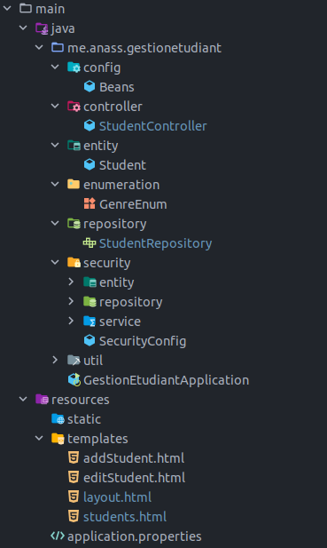
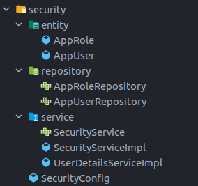

# Gestion des étudiants

Lien de le video, cliquer sur le logo youtube
[](https://youtu.be/YPdCgY9nDsQ)


## Introduction
Cette application de gestion des étudiants est développée avec Spring, on utilisant les dépendances Spring Data JPA, Spring Web et Spring Security.  
Le but de cette application est de mettre en pratique l'approche rendu coté serveur (SSR).


L’application gère une seule entité principale qui est Student, en  plus des AppUser et AppRole pour la partie de securité
## Structure de l'application

## JPA
### Student Entity
```java
package me.anass.gestionetudiant.entity;

import lombok.*;
import me.anass.gestionetudiant.enumeration.GenreEnum;
import org.springframework.format.annotation.DateTimeFormat;

import javax.persistence.*;
import javax.validation.constraints.Email;
import javax.validation.constraints.NotEmpty;
import javax.validation.constraints.NotNull;
import javax.validation.constraints.Size;
import java.util.Date;

@Entity
@Getter
@Setter
@AllArgsConstructor
@NoArgsConstructor
@Builder
@ToString
public class Student {
    @Id
    @GeneratedValue(strategy = GenerationType.IDENTITY)
    private Long id;

    @NotNull
    @NotEmpty
    @Size(min = 3, max = 20)
    private String nom;

    @NotNull
    @NotEmpty
    @Size(min = 3, max = 20)
    private String prenom;

    @Email
    private String email;

    @Temporal(TemporalType.DATE)
    @DateTimeFormat(pattern = "yyyy-MM-dd")
    private Date dateNaissance;

    @Enumerated(EnumType.STRING)
    private GenreEnum genre;

    private boolean enRegle;
}
```

### Student Repository

```java
package me.anass.gestionetudiant.repository;

import me.anass.gestionetudiant.entity.Student;
import org.springframework.data.domain.Page;
import org.springframework.data.domain.Pageable;
import org.springframework.data.jpa.repository.JpaRepository;

public interface StudentRepository extends JpaRepository<Student, Long> {
    Student findByNom(String string);
    Page<Student> findByNomContainsIgnoreCaseOrPrenomContainsIgnoreCaseOrderByIdDesc(String nom, String prenom, Pageable pageable);
}
```

### Student Controller
L'application permet a l'utilisateur d'afficher la liste des etudiants avec une pagination, pour cela, un controller est mise en place pour garentir cette fontionnalité

### Controlleur pour la recuperation des etudiants

La chose qui est un peut delicate a manipuler dans SSR, c'est le passage des parametres entre les pages, il faut toujours attacher ces sernier dans le URL
```java
@GetMapping("/index")
public String student(
        Model model,
        @RequestParam(value = "page", defaultValue = "0") int page,
        @RequestParam(value = "size", defaultValue = "5") int size,
        @RequestParam(value = "keyword", defaultValue = "") String keyword
){
    Page<Student> studentPage = studentRepository.findByNomContainsIgnoreCaseOrPrenomContainsIgnoreCaseOrderByIdDesc(keyword, keyword,PageRequest.of(page, size));

    model.addAttribute("students", studentPage.getContent());
    model.addAttribute("pagesNbr", new int[studentPage.getTotalPages()]);
    model.addAttribute("currentPage", page);
    model.addAttribute("keyword", keyword);
    return "students";
}
```

## Security
### Structure de la partie securite

Pour gerer les utilisateurs et les roles, nous avons creer deux entites JPA, AppUser et AppRole en plus de leurs repositories et service correspondant, tous cela dans le meme package 'security', pour assurer une portabilite de cette couche technique.



Puisque les utilisateurs sont gerer cote SPring, alors on doit indiquer a Spring Security comment il va proceder pour recuperer ces dernier, alors pour cela on mentionne dans la classe de configuration de spring qu'il doit utilise la strategie UserDetailService

### SecurityConfig::configure(AuthenticationManagerBuilder auth)
```java
    @Override
    protected void configure(AuthenticationManagerBuilder auth) throws Exception {
        auth.userDetailsService(userDetailsService);
    }
```

### UserDetailsServiceImpl::loadUserByUsername
```java
@Service
@AllArgsConstructor
public class UserDetailsServiceImpl implements UserDetailsService {

    private SecurityService securityService;

    @Override
    public UserDetails loadUserByUsername(String username) throws UsernameNotFoundException {
        AppUser appUser = securityService.loadAppUserByUsername(username);
        List<GrantedAuthority> authorities = new ArrayList<>();

        appUser.getRoles().forEach( role -> authorities.add(new SimpleGrantedAuthority(role.getRoleName())));

        return new User(appUser.getUsername(), appUser.getPassword(), authorities);
    }
}
```
### SecurityConfig::configure(HttpSecurity http)
```java
    @Override
    protected void configure(HttpSecurity http) throws Exception {
        http.formLogin();
        http.authorizeRequests().antMatchers("/").
                permitAll();

        http.authorizeRequests()
                .antMatchers("/delete/**", "/formAdd/**", "/formEdit/**", "/addStudent/**")
                .hasAuthority("ADMIN");

        http.authorizeRequests()
                .antMatchers("/index/**")
                .hasAuthority("USER");

        http.authorizeRequests()
                .anyRequest()
                .authenticated();
    }
```
